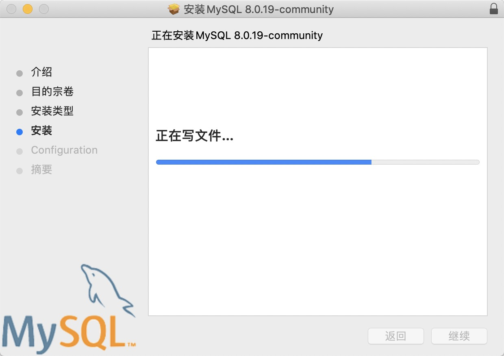

# MySQL 数据库安装

[toc]

## 1、🍓 MySQL 安装包下载

无论是 `Mac` 平台，还是 `Windows` 平台，我们首先要做的是下载对应的安装程序。

MySQL 官网：https://www.mysql.com/

进入下载页：https://www.mysql.com/downloads/

然后找到社区（免费）版本，[MySQL Community (GPL) Downloads](https://dev.mysql.com/downloads/)

## 2、🍉 Mac 下的 MySQL安装

### 2-1、下载

`Mac` 下的 `MySQL` 安装包下载，需要

在下载页面点击进入：[MySQL Community Server](https://dev.mysql.com/downloads/mysql/) ，也就是 `MySQL` 社区（免费）版服务端页面

随后在操作系统一栏中选择 `MacOS`

再选择 `DMG`，也就是 `Mac` 下的安装程序

> 注意：新手请选择 `DMG` 类型的，避免不必要的麻烦！

不用注册，立即下载即可

### 2-2、安装

#### 2-2-1、双击 `dmg` 安装程序

#### 2-2-2、双击 `pkg` 安装包

#### 2-2-3、开始安装

#### 2-2-4、介绍

#### 2-2-5、安装类型（目的宗卷） - 安装路径

#### 2-2-6、安装

#### 2-2-7、Configuration - 配置

> 这里选择第二项（使用MySQL 5.x）的链接验证方式，因为一些客户端可能并不兼容新的 MySQL8 的方式

#### 2-2-8、Configuration - 密码

> `root` 账户的密码，最好不少于8个字符，且最好是字母、数字、其它一些特殊字符的组合
>
> 下面勾选表示安装成功以后就启动 MySQL 服务
>
> 点击 Finish 完成安装

#### 2-2-9、大功告成

### 2-3、启动

后续我们可以通过 `Mac` 系统偏好设置来管理 `MySQL` 服务

## 3、🍊 Windows 下的 Mysql 安装

### 3-1、下载

`Windows` 下的安装包下载就不要进入 `MySQL Community Server` 了，直接点击下面框红的 `MySQL Installer for Windows` 就可以了，它是 `MySql` 的安装版，类似 `Mac` 下的 `dmg`

随后，选择 `MSI Installer` 

- 第一个为在线安装（web）
- 第二个为线下安装（推荐，下载下来以后，没网络的情况下也不影响安装）

不用注册，继续感谢他一下就可以了

### 3-2、安装

双击下载下来的安装程序，进入安装界面

#### 3-2-1、选择数据库安装模式

- Developer Default：开发模式，安装mysql开发所需的所有产品
- Server Only：服务器模式，只安装mysql服务器产品
- Client Only：客户端模式，只安装没有服务器的mysql客户端产品
- Full：完整模式，安装所有包含的mysql产品和功能
- Custom：自定义模式，手动选择系统上应安装的产品

这里我们可以先选择 `Server Only` ，就可以使用数据库服务了

#### 3-2-2、安装依赖

这一步会根据上一个步骤中选择的安装类型，安装一些对应的依赖库和软件

> 要先 `Execute` 安装依赖，不要去点击 `Next`

#### 3-2-3、安装数据库服务器

安装成功

#### 3-2-4、数据库服务器类型

- 独立经典类型
- 集群沙箱类型

我们选择第一个就可以

#### 3-2-5、数据库网络配置

- Config Type：选择 `Development Computer` ，一般学习应用足够
- 协议，端口，以及防火墙设置，保存下图默认就可以

#### 3-2-6、鉴权验证方法

如同  `Mac` 安装的时候一样，我们使用兼容的 `MySQL5.x` 的方法

#### 3-2-7、设置root密码

这里设置 `root` 账户的密码（一定要记住），或添加新的账户

#### 3-2-8、配置 Windows 服务

保持下图默认就行，这个配置在后续的 `Mysql` 管理中会用到

#### 3-2-9、配置安装

看到这个，就表示安装成功完成了！！！

#### 3-2-10、MySQL 安装管理器

这个工具可以帮助我们后续修改、更新和删除机器上安装的 MySQL

### 3-3、MySQL管理

#### 3-3-1、启动/关闭MySQL

还记得前面我们安装系统服务（3-2-8）吗，现在我们就可以使用它来启动和关闭 MySQL

我的电脑（此电脑）右键 -> 管理

选择服务

找到 MySQL 服务（名字为步骤 3-2-8 中一致）

启动与停止服务

### 3-4、MySQL连接

使用一些客户端工具（Navicat等）连接 MySQL（确认 MySQL 服务是开启的）

填写对应数据库以及账户信息

连接成功

## 4、🍑 结语

到此为止，我们把 MySQL 在 `Mac` 和 `Windows` 上的基本安装和连接讲完了，希望能够帮助大家顺利的安装好 `MySQL`，为我们后续的学习做好准备！！！