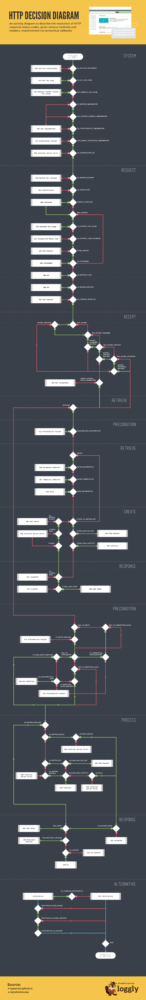

# 后端-开发前的准备工作

[toc]

## 1、🍉 技术栈

### 1-1、开发类

这一部分主要是与具体编码相关的库或者框架，比如：`Koa` 等。

**koa**

后端的主框架。

**koa-router**

基于 `Koa` 的路由。

**koa-static-cache**

`koa` 静态文件代理。

**koa-ts-controllers**

基于 `Koa` 和 `TypeScript` 构建的路由控制系统，它提供了各种装饰器来构建 `RESTful` 风格的 `API`。

**mysql2**

`NodeJS` 连接操作 `MySQL` 的库。

**sequelize**

一个功能更丰富和强大的数据库操作库，支持 `MySQL`、`MSSQL`、`SQLite` 等数据库，提供了 `ORM`、`事务` 以及 `Promise` 等支持。

**sequelize-typescript**

`sequelize` 的 `TypeScript` 版

**class-validator**

基于 `validator.js` 和 `TypeScript` 的数据验证工具，对用户或者接口调用传入的数据进行校验。

**jsonwebtoken**

`JWT` 鉴权库。

**moment**

日期时间处理工具。

### 1-2、工具类

这一部分主要是一些辅助工具，比如：`Sequelize-cli` 等。

**ts-node-dev**

`ts-node`  的 `dev` 版，实现了热重载（修改代码即可自动重启服务）。

**sequelize-cli**

`sequelize` 提供了的 `CLI` 工具，可以通过它来维护数据库。

> 注意：大家在看视频学习和自己动手实践的时候，一定要注意所使用的框架与库的版本，不同的版本或多或少都会存在差异，如果有什么问题，记得确认下是否是因为版本差异所带来的。


## 2、🍓 接口规范

在接口规范方面，我们遵循 `RESTful` 规范，合理的利用 `请求方法`、`状态码` 等来设计 `API`，参考如下：

### 2-1、资源路径

因为当前应用没有把接口数据与静态资源（如图片等）进行分开放置，所以为了进行区分，接口以 `/api` 作为前缀，静态资源以 `/public` 作为前缀。

为了更方便的对接口进行管理以及后续的升级，路径后同时携带当前接口的版本，如：`/api/v1/signin`

### 2-2、其它规范

#### 2-2-1、获取

**请求方法**：GET

**响应状态码**：200

**响应主体**：被请求的资源内容

```json
[
  	{
        "id": 1,
        "name": "zhangsan"
    },
  	{
        "id": 2,
        "name": "lisi"
    }
]
```

#### 2-2-2、创建

**请求方法**：POST

**响应状态码**：201

**响应主体**：被创建的资源内容

```json
{
  	"id": 3,
  	"name": "wangwu"
}
```

#### 2-2-3、更新

**请求方法**：PUT

**响应状态码**：204

**响应主体**：无

#### 2-2-4、删除

**请求方法**：DELETE

**响应状态码**：204

**响应主体**：无

### 2-3、错误处理

应用中的错误会返回对应的状态码，主要有：

#### 2-3-1、请求错误

**资源不存在**：404

**请求参数异常**：422

#### 2-3-2、授权验证错误

**没有授权/登陆**：401

**禁止访问**：403

```json
{
  	// 状态码
    "statusCode": 422,
  	// 状态码对应描述
    "error": "Unprocessable Entity",
  	// 错误信息
    "message": "validation error for argument type: body",
  	// 错误详情
    "errorDetails": [
        {
            "field": "age",
            "violations": {
                "isNumber": "年龄必须为数字"
            }
        }
    ]
}
```


## 3、🍊 HTTP 响应图示



